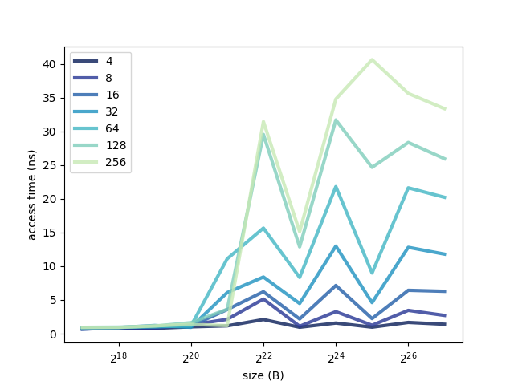

# Report

## 1


|  |
| :---: |
| *Среднее время ожидания для запросов разной длины и размера.* |

## 2

Можно заметить наличие 4-х уровней кеша при следующих размерах массива 2<sup>20</sup>, 2<sup>21</sup>, 2<sup>23</sup> и 2<sup>25</sup>.

## 3

Данные процессора:

```
lscpu
...
L1d cache:                       128 KiB
L1i cache:                       256 KiB
L2 cache:                        2 MiB
L3 cache:                        4 MiB
...
```

```
cat /proc/cpuinfo
...
cache_alignment	: 64
...
```